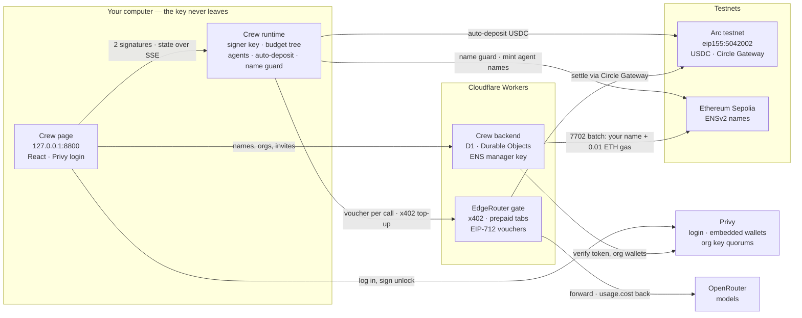

# crew-ai

Two products in one monorepo, built for a hackathon:

- **Crew AI** — a crew of AI agents that pay per call in USDC. Each agent has its
  own ENS name and a budget it cannot raise, and every reply shows what it cost.
- **EdgeRouter** — an x402 gate in front of OpenRouter. Pay per request with a
  wallet instead of an API key; no account, no signup.

Crew AI is one client of EdgeRouter. They share a repo and some packages, not an
identity: nothing in Crew AI is named after EdgeRouter, and EdgeRouter works for
any x402 client.

```bash
npm install -g @harsh132/crew-ai
crew                      # then open http://127.0.0.1:8800
```

Or run it in Docker:

```bash
docker run -d --name crew -p 127.0.0.1:8800:8800 -v crew-data:/data harsh132/crew-ai
```

## Architecture



**Arc for money.** USDC is Arc's gas token, so the crew never needs a second
asset to pay. USDC that lands in the crew's wallet is deposited into Circle
Gateway automatically (above 0.10 USDC, keeping 0.05 back).

**Sepolia for names.** ENSv2 registries and resolvers, so users can later bring
their own `.eth` names.

**Your computer for keys.** The page, the backend and the gate can ask for
things; only the runtime signs.

### One paid model call

```
agent    → runtime   call a model
runtime              capability allows it? budget left?
runtime  → Sepolia   does this agent's name resolve to the signer?
runtime  → gate      request + EIP-712 voucher against the tab
gate     → OpenRouter, reply + usage.cost
gate     → runtime   reply + receipt, tab debited by the real cost
runtime  → agent     answer + cost

when the tab runs low:
runtime  → gate      x402 top-up from the Gateway balance
gate     → Arc       settles as a Gateway nanopayment
```

## Crew AI

### Keys you never back up

The crew's signer key is derived from your wallet's signature, not generated:

1. Log in with Privy (email, browser wallet or WalletConnect).
2. Sign an EIP-712 `CrewSigner` message twice. Deterministic signing makes both
   signatures identical; if they differ, the unlock is refused.
3. `key = keccak256("crew signer v1" ‖ r ‖ s)`. The signature is never written
   to disk.
4. The key is cached in `~/.crew-ai/wallet.json`.

Sign in with the same wallet on any computer and you get the same crew back.

### Names

```
crewai.eth                       owner 0x3f87…a2d3
└─ alex.crewai.eth               owned by your wallet, set up by the backend in one tx
   ├─ researcher.alex.crewai.eth minted by your crew signer when you hire
   └─ writer.alex.crewai.eth

acme.eth                         an organization's own name (Privy org wallet)
└─ crew.acme.eth
   └─ alex.crew.acme.eth         issued when alex accepts an invite
```

The backend claims your name with one EIP-7702 batch (registry, resolver,
roles, address) and sends your signer 0.01 ETH on Sepolia to cover agent names.
Before every payment, the runtime checks that the paying agent's name still
resolves — a revoked agent cannot pay.

Organizations invite members by their Crew name. The member sees a pop-up,
accepts, and gets a name under the organization's `crew.` subname.

### Budgets: delegation without handing over the wallet

An agent never holds a key. It holds a capability, and asks the runtime to sign
one payment at a time; the runtime charges that payment to the agent's node in
a budget tree, and an empty node buys nothing.

```
caveats   stateless, checked per request    per-call ceiling, expiry, hosts, depth
tree      stateful, in the runtime          cumulative budget, funding, revocation
```

**Attenuation only narrows**, and not because a rule forbids widening. Macaroon
semantics: appending a caveat is one HMAC, removing one needs a signature that
was destroyed when it was added. Widening is unreachable, not prohibited.

**Revocation is emptying, not listing.** Sweep a node and its subtree; a valid
token over an empty balance grants nothing, so there is no revocation list.

The refusal comes from the side holding the money. A cap an agent enforces on
itself is not a cap.

### Run it from source

```bash
bun install
bun run --cwd apps/crew server      # runtime on 127.0.0.1:8800
bun run --cwd apps/crew dev         # page with hot reload on :5180
```

| Variable | Default | |
|---|---|---|
| `CREW_PORT` | `8800` | Port the runtime serves on |
| `CREW_NETWORK` | `eip155:5042002` | Payment network (Arc testnet) |
| `CREW_GATE` | the hosted EdgeRouter gate | Inference gate URL |
| `CREW_BACKEND` | the hosted Crew backend | Names and organizations |
| `CREW_AUTO_DEPOSIT` | on | `off` stops depositing into Gateway |
| `CREW_HOME` | `~/.crew-ai` | Where the crew's key and data live |
| `CREW_HOST` | `127.0.0.1` | Address to listen on; only a container needs to change it |
| `CREW_PAGE_ORIGINS` | none | Extra page origins allowed to unlock, comma-separated |

The backend (`apps/crew-backend`) needs `PRIVY_APP_ID`, `PRIVY_APP_SECRET`,
`ENS_MANAGER_PRIVATE_KEY` and `SEPOLIA_RPC` in `.dev.vars`:

```bash
bun run --cwd apps/crew-backend migrate:local
bun run --cwd apps/crew-backend dev
```

## EdgeRouter

An OpenAI-compatible endpoint behind x402. Point any existing client at it:

```
price the request  →  402 or accept payment  →  verify  →  settle
→  proxy to OpenRouter  →  stream the answer back
```

| Route | |
|---|---|
| `GET /v1/models` | Models and prices |
| `POST /v1/chat/completions` | Paid per request, or from a tab |
| `POST /v1/tab/topup` | Prepay a tab with one x402 payment |
| `GET /v1/tab?payer=…&network=…` | A payer's tab balance |

Networks: Arc testnet (settled through Circle Gateway), Base Sepolia and Hedera
testnet — each settled by the facilitator that actually covers it.

### Settle before serve

The gate **settles before it serves**. Nothing is spent on a caller's behalf
until their money has moved. Serving first means extending credit; credit needs
an identity; an identity is only worth checking if it cannot be minted for free;
and the only unmintable identity would be a token the gate issues — a signup.
Settling first removes the whole chain.

### Tabs

Settling on-chain per call is too slow and too expensive for chat. A tab is
prepaid once with x402, then each call carries an EIP-712 voucher and is debited
by what OpenRouter reports in `usage.cost` — so the payer is charged what the
call actually cost, not a worst-case quote.

Answers stream. The receipt rides in a header sent ahead of the first byte, so
a streamed answer is paid for as completely as a buffered one.

```bash
bun run dev                          # wrangler dev for apps/gate
```

## Layout

```
apps/crew            Crew runtime (Node/Bun) and page (React)
apps/crew-backend    Crew names, orgs and invites — Cloudflare Worker, D1, Durable Objects
packages/crew-ai     the `crew` npm package: bundled runtime + built page
packages/ens         ENSv2 registries, resolvers, EIP-7702 batching, name guard
apps/gate            EdgeRouter — the x402 gate, a Cloudflare Worker
packages/core        attenuation algebra and funding rules, no dependencies
packages/sdk         x402 client, wallets, Circle Gateway, tabs, budget authority
packages/dsh         DeepSeek Harness provider plugin for EdgeRouter
docs/                product thesis, findings, specs
```

## Checks

```bash
bun run check          # every offline check
bun run typecheck
```

Anything that spends is separate and run by hand, because it spends:

```bash
bun run arc-pay-check          # one payment on Arc through Circle Gateway
bun run pay-check              # one Hedera payment
bun run evm-pay-check          # one EIP-3009 payment
bun run delegate-live-check    # a keyless sub-agent, to its limit
bun run ens-check              # ENSv2 names on Sepolia
bun run ens-guard-check        # the name guard against the real registry, reads only
bun run ens-revoke-check       # a revoked agent cannot pay
```

`packages/core` has no dependencies on purpose. The claim the budgets rest on —
that a delegated budget can only narrow — is checked against random trees and
random caveat orders, with no network, no chain and no API key.

## Status

Testnets only, deliberately: Arc testnet for payments, Ethereum Sepolia for
names. Keep working money in a crew, not savings.

Details in [docs/PROJECTS.md](docs/PROJECTS.md).
